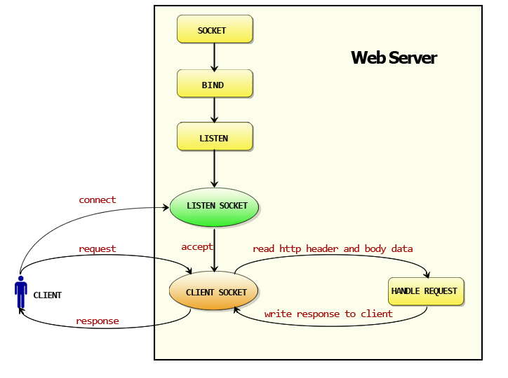
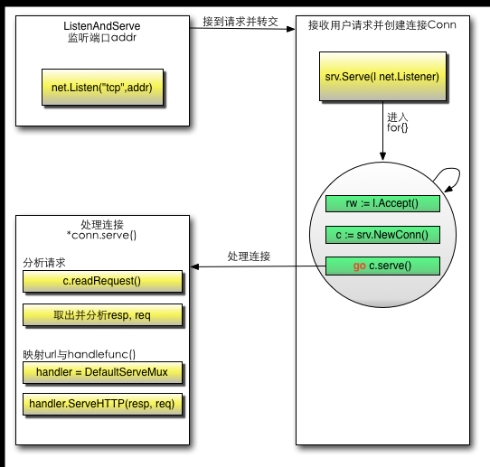

# Go Web

## Web工作方式

浏览器本身是一个客户端，当你输入URL的时候，首先浏览器会去请求DNS服务器，通过DNS获取相应的域名对应的HTTP Request包后，服务器接收到请求包之后才开始处理请求包，服务器调用自身服务，返回HTTP Response包；客户端收到来自服务器的响应后开始渲染这个Response包里的主体，等收到全部的内容随后断开与该服务器之间的TCP连接。

### Web服务器的工作原理可以简单地归纳为

- 客户机通过TCP/IP协议建立到服务器的TCP连接
- 客户端向服务器发送HTTP协议请求包，请求服务器里的资源文档
- 服务器向客户机发送HTTP协议应答包，如果请求的资源包含有动态语言的内容，那么服务器会调用动态语言的解释引擎负责处理“动态内容”，并将处理得到的数据返回给客户端。
- 客户机与服务器断开。由客户端解释HTML文档，在客户端屏幕上渲染图形结果。

**DNS是域名系统，是一种组织成域层次结构的计算机和网络服务命名系统，它用于TCP/IP网络，从事将主机名或域名转换为实际IP地址的工作。**

HTTP是一个无状态的面向连接的协议，无状态不代表HTTP不能保持TCP连接，更不能代表HTTP使用的是UDP协议（面向无连接）

***

## 3.3 Go如何使得Web工作





## 3.4 Go的http包详解

Go的HTTP有两个核心功能：Conn、ServeMux

**Conn的goroutine**

与我们一般编写的http服务器不同，Go为了实现高并发和高性能，使用了goroutine来处理Conn的读写事件，这样每个请求都能保持独立，相互不会阻塞，可以高效的响应网络事件。这是Go高效的保证。

Go在等待客户端请求里面是这样写的：

```
c, err := srv.newConn(rw)
if err != nil {
    continue
}
go c.serve()
```
客户端的每次请求都会创建一个Conn，这个Conn里面保存了该次请求的信息，然后再传递到对应的handler，该handler中便可以读取到相应的header信息，这样保证了每个请求的独立性。

**ServeMux的自定义**

讲述conn.server的时候，其实内部是调用了http包默认的路由器，通过路由器把本次请求的信息传递到了后端的处理函数。该路由的实现如下

```

type ServeMux struct {
	mu sync.RWMutex   //锁，由于请求涉及到并发处理，因此这里需要一个锁机制
	m  map[string]muxEntry  // 路由规则，一个string对应一个mux实体，这里的string就是注册的路由表达式
	hosts bool // 是否在任意的规则中带有host信息
}
```

看一下muxEntry
```
type muxEntry struct {
	explicit bool   // 是否精确匹配
	h        Handler // 这个路由表达式对应哪个handler
	pattern  string  //匹配字符串
}
```
看一下Handler的定义
```
type Handler interface {
	ServeHTTP(ResponseWriter, *Request)  // 路由实现器
}
```

Handler是一个接口，但是前一小节中的*sayhelloName*函数并没有实现ServeHttp这个接口，为什么能添加呢？原来在http包里面还定义了一个类型HandlerFunc,我们定义的函数sayhelloName就是这个HandlerFunc调用之后的结果，这个类型默认就实现了ServeHTTP这个接口，即我们调用了HandlerFunc(f),强制类型转换f成为HandlerFunc类型，这样f就拥有了ServeHTTP方法。

### Go代码的执行流程

通过对http包的分析之后，梳理一下整个代码执行过程

- 首先调用Http.HandleFunc

按顺序做了几件事

1. 调用了DefaultServeMux的HandleFunc
2. 调用了DefaultServeMux的Handle
3. 往DefaultServeMux的map[string]muxEntry中增加对应的handler和路由规则

- 其次调用http.ListenAndServe(":9090",nil)

按顺序做了几件事情

1. 实例化Server
2. 调用Server的ListenAndServe()
3. 调用net.Listen("tcp",addr)监听端口
4. 启动一个for循环，在循环体中Accept请求
5. 对每个请求实例化一个Conn，并且开启一个goroutine为这个请求进行服务go c.serve()
6. 读取每个请求的内容 w, err := c.readRequest()
7. 判断handler是否为空，如果没有设置handler,handler就设置为DefaultServeMux
8. 调用handler的ServeHttp
9. 在这个例子中，下面就进入到DefaultServeMux.SereHttp
10. 根据request选择handler,并且进入到这个handler的ServeHTTP

```
  mux.handler(r).ServeHTTP(w, r)
```
11. 选择handler

> A 判断是否有路由能满足这个request（循环遍历ServeMux的muxEntry）

> B 如果有路由满足，调用这个路由handler的ServeHTTP

> C 如果没有路由满足，调用NotFoundHandler的ServeHTTP

## 3.5 小结

这一章介绍了HTTP协议，DNS解析的过程，用GO实现一个简陋的web server。并深入到net/http包的源码中实现此server的秘密。