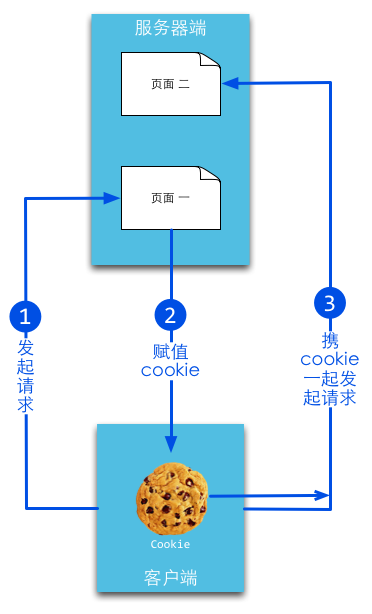

# session和数据存储

Web开发中一个很重要的议题就是如何做好用户的整个浏览过程的控制，因为HTTP协议是无状态的，所以用户的每一次请求都是无状态的，我们不知道在整个Web操作过程中哪些连接与该用户有关，我们应该如何来解决这个问题呢？

Web里面经典的解决方案是cookie和session，Cookie机制是一种客户端机制，把用户数据保存在客户端，而session机制是一种服务器端的机制，服务器使用一种类似于散列表的结构来保存信息，每一个网站访客都会被分配给一个唯一的标志符，即SessionID，它的存放形式无非两种：要么经过URL传递，要么保存在客户端的cookies里，当然，你也可以将session保存到数据库里，这样会更安全，但效率方面会有所下降。

6.1小节里面讲介绍session机制和cookie机制的关系和区别，6.2讲解Go语言如何来实现session，里面讲实现一个简易的session管理器，6.3小节讲解如何防止session被劫持的情况，如何有效的保护session。我们知道session其实可以存储在任何地方，6.4小节里面实现的session是存储在内存中的，但是如果我们的应用进一步扩展了，要实现应用的session共享，那么我们可以把session存储在数据库中(memcache或者redis)，6.5小节将详细的讲解如何实现这些功能。

## 6.1 session和cookie

cookie简而言之就是在本地计算机保存一些用户操作的历史信息，并在用户再次访问该站点时浏览器通过HTTP协议将本地Cookie内容发送给服务器，从而完成验证，或继续上一步操作。



session就是在服务器上保存用户操作的历史信息。服务器使用session id来标识session，session id由服务器负责产生，保证随机性与唯一性，相当于一个随机密钥，避免在握手或传输中暴露用户真实密码。但该方式下，仍然需要将发送请求的客户端与session进行对应，所以可以借助cookie机制来获取客户端的标识（即session id），也可以通过GET方式将id提交给服务器。


**cookie**

Cookie是由浏览器维持的，存储在客户端的一小段文本信息，伴随着用户请求和页面在web服务器和浏览器之间传递。用户每次访问站点时，Web应用程序都可以读取cookie包含的信息。

如果不设置过期时间，则表示这个cookie的生命周期为从创建到浏览器关闭为止，只要关闭浏览器窗口，cookie就消失了。这种生命期为浏览会话期的cookie被称为会话cookie。会话cookie一般不保存在硬盘上而是保存在内存里。

如果设置了过期时间，浏览器就会把cookie保存到硬盘上，关闭后再次打开浏览器，这些cookie依然有效直到超过设定的过期时间。

### Go设置cookie

Go通过net/http包中的SetCookie来设置：

```
http.SetCookie(w ResponseWriter, cookie *Cookie)
```

w表示需要写入的response，cookie是一个struct，让我们来看一下cookie对象是怎么样的

```
type Cookie struct {
	Name       string
	Value      string
	Path       string
	Domain     string
	Expires    time.Time
	RawExpires string

// MaxAge=0 means no 'Max-Age' attribute specified.
// MaxAge<0 means delete cookie now, equivalently 'Max-Age: 0'
// MaxAge>0 means Max-Age attribute present and given in seconds
	MaxAge   int
	Secure   bool
	HttpOnly bool
	Raw      string
	Unparsed []string // Raw text of unparsed attribute-value pairs
}
```

我们来看一个例子，如何设置cookie

```
expiration := time.Now()
expiration = expiration.AddDate(1, 0, 0)
cookie := http.Cookie{Name: "username", Value: "astaxie", Expires: expiration}
http.SetCookie(w, &cookie)
```

### Go读取cookie

```
cookie, _ := r.Cookie("username")
fmt.Fprint(w, cookie)

//another way
for _, cookie := range r.Cookies() {
	fmt.Fprint(w, cookie.Name)
}
```

**session**

含义是指有始有终的一系列动作/消息。session在Web开发环境下的语义又有了扩展，它的含义是指一类用来在客户端与服务器端之间保持状态的解决方案。有时候Session也用来指这种解决方案的存储结构。

session机制是一种服务器端的机制，服务器使用一种类似于散列表的结构来保存信息

### 小结

如上文所述，session和cookie的目的相同，都是为了克服http协议无状态的缺陷，但完成的方法不同。session通过cookie，在客户端保存session id，而将用户的其他会话消息保存在服务端的session对象中，与此相对的，cookie需要将所有信息都保存在客户端。因此cookie存在着一定的安全隐患，例如本地cookie中保存的用户名密码被破译，或cookie被其他网站收集（例如：1. appA主动设置域B cookie，让域B cookie获取；2. XSS，在appA上通过javascript获取document.cookie，并传递给自己的appB）。

通过上面的一些简单介绍我们了解了cookie和session的一些基础知识，知道他们之间的联系和区别，做web开发之前，有必要将一些必要知识了解清楚，才不会在用到时捉襟见肘，或是在调bug时如无头苍蝇乱转。接下来的几小节我们将详细介绍session相关的知识。

## 6.2 Go如何使用session

**session创建过程**

session的基本原理是由服务器为每个会话维护一份信息数据，客户端和服务端依靠一个全局唯一的标识来访问这份数据，以达到交互的目的。当用户访问Web应用时，服务端程序会随需要创建session，这个过程可以概括为三个步骤：

- 生成全局唯一标识符（sessionid）
- 开辟数据存储空间（一般在内存中创建相应的数据结构，若要持久化可以将会话数据写到文件或存储在数据库中）
- 将session的全局唯一标识符发送给客户端

最关键在于如何发送sessionoid。考虑到HTTP协议的定义，数据无非可以放到请求行、头域或Body里，所以一般来说会有两种常用的方式：cookie和URL重写

1. Cookie服务端通过设置Set-cookie头就可以将session的标识符传送到客户端，而客户端此后的每一次请求都会带上这个标识符
2. URL重写就是在返回给用户的页面里的所有的URL后面追加session标识符，这样用户在收到响应之后，无论点击页面那个链接或提交表单都会自动带上session标识符，从而就实现了会话的保持。

**Go实现session管理**

session管理涉及到如下几个因素

- 全局session管理器
- 保证sessionid的全局唯一性
- 为每个客户关联一个session
- session的存储（可以存储到内存、文件、数据库等）
- session过期处理

## 6.3 session存储

## 6.4 预防session劫持

session劫持是一种广泛存在的比较严重的安全威胁，在session技术中，客户端和服务端通过session的标识符来维护会话，但这个标识符很容易就能被嗅探到，从而被其他人利用。它是中间人攻击的一种类型。

### session劫持防范

**cookieonly和token**

解决方案之一是sessionID的值只允许cookie设置，而不是通过URL重置方式设置，同时设置cookie的httponly为true，这个属性是设置是否可通过客户端脚本访问这个设置的cookie，第一这个可以防止这个cookie被XSS读取从而引起session劫持，第二cookie设置不会像URL重置方式那么容易获取sessionID。

第二步就是在每个请求里面加上token，实现类似前面章节里面讲的防止form重复递交类似的功能，在每次请求里面加上一个隐藏的token，然后每次验证这个token，从而保证用户的请求都是唯一性

**间隔生成新的SID**

还有一个解决方案就是，我们给session额外设置一个创建时间的值，一旦过了一定的时间，我们销毁这个sessionID，重新生成新的session，这样可以一定程度上防止session劫持的问题。

## 6.5 小结

学习了什么是session，什么是cookie，以及他们两者之间的关系。但是目前Go官方标准包里面不支持session，所以我们设计了一个session管理器，实现了session从创建到销毁的整个过程。然后定义了Provider的接口，使得可以支持各种后端的session存储，然后我们在第三小节里面介绍了如何使用内存存储来实现session的管理。第四小节我们讲解了session劫持的过程，以及我们如何有效的来防止session劫持。通过这一章的讲解，希望能够让读者了解整个sesison的执行原理以及如何实现，而且是如何更加安全的使用session。