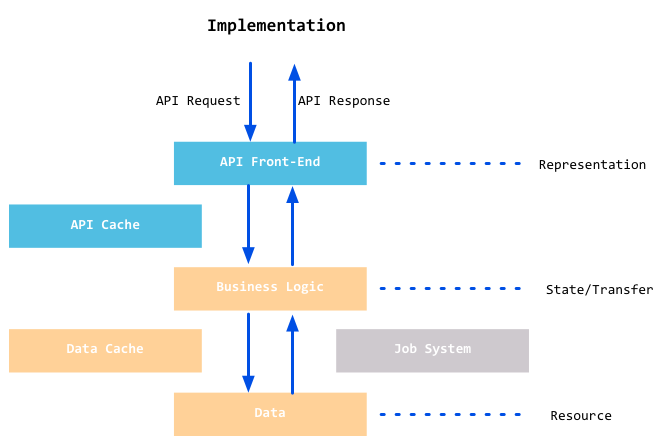

# Web服务

Web服务可以在HTTP协议的基础上通过XML或者JSON来交换信息。如果你想知道上海的天气预报、中国石油的股价或者淘宝商家的一个商品信息，你可以编写一段简短的代码，通过抓取这些信息然后通过标准的接口开放出来，就如同你调用一个本地函数并返回一个值。

目前主流的有如下几种Web服务：REST、SOAP。

REST请求是很直观的，因为REST是基于HTTP协议的一个补充，他的每一次请求都是一个HTTP请求，然后根据不同的method来处理不同的逻辑。

SOAP是W3C在跨网络信息传递和远程计算机函数调用方面的一个标准。但是SOAP非常复杂，其完整的规范篇幅很长，而且内容仍然在增加。

Go追求的是性能、简单。

## 8.1 Socket编程

**什么是Socket？**

Socket起源于Unix，而Unix基本哲学之一就是“一切皆文件”，都可以用“打开open->读写write/read->关闭close”模式来操作。Socket就是该模式的一个实现，网络的Socket数据传输是一种特殊的I/O，Socket也是一种文件描述符。Socket也具有一个类似于打开文件的函数调用：Socket()，该函数返回一个整形的Socket描述符，随后的连接建立，数据传输等操作都是通过该Socket实现的。

常用的Socket类型有两种：流式socket和数据报式Socket。流式是一种面向连接的socket，针对于面向连接的TCP服务应用；数据报式socket是一种无连接的socket，对应于无连接的UDP服务应用。

**socket如何通信**

如何通信首要解决的问题是如何唯一标识一个进程，否则通信无从谈起！本地可以通过进程PID来标识进程，但网络中行不通。但TCP/IP协议簇帮我们解决了这个问题，网络层的"ip地址"可以唯一标识网络中的主机，而传输层的"协议+端口"可以唯一标识主机中的应用程序（进程）。这样利用三元组（ip地址，协议，端口）就可以标识网络的进程了，网络中需要互相通信的进程，就可以利用这个标志在他们之间进行交互。

**Socket基础知识**

### TCP Socket

当我们知道如何通过网络端口访问一个服务时，那么我们能够做什么呢？*作为客户端来说，我们可以通过向远端某台机器的的某个网络端口发送一个请求，然后得到在机器的此端口上监听的服务反馈的信息。作为服务端，我们需要把服务绑定到某个指定端口，并且在此端口上监听，当有客户端来访问时能够读取信息并且写入反馈信息。*

在Go语言的net包中有一个类型TCPConn，这个类型可以用来作为客户端和服务器端交互的通道，他有两个主要的函数：

```
func (c *TCPConn) Write(b []byte) (int, error)
func (c *TCPConn) Read(b []byte) (int, error)
```

TCPConn可以用在客户端和服务端来读写数据。

还有我们需要知道一个TCPAddr类型，他表示一个TCP的地址信息，他的定义如下：

```
type TCPAddr struct {
	IP IP
	Port int
	Zone string // IPv6 scoped addressing zone
}
```

在Go语言中通过ResolveTCPAddr获取一个TCPAddr

```
func ResolveTCPAddr(net, addr string) (*TCPAddr, os.Error)
```

- net参数是"tcp4"、"tcp6"、"tcp"中的任意一个，分别表示TCP(IPv4-only), TCP(IPv6-only)或者TCP(IPv4, IPv6的任意一个)。
- addr表示域名或者IP地址，例如"www.google.com:80" 或者"127.0.0.1:22"。

### TCP client

Go语言中通过net包中的DialTCP函数来建立一个TCP连接，并返回一个TCPConn类型的对象，当连接建立时服务端也创建一个同类型的对象，此时客户端和服务器端通过各自拥有的TCPConn对象来进行数据交换。一般而言，客户端通过TCPConn对象将请求信息发送到服务器端，读取服务器端响应的信息。服务器端读取并解析来自客户端的请求，并返回应答信息，这个连接只有当任一端关闭了连接之后才失效，不然这连接可以一直在使用。建立连接的函数定义如下：

```
func DialTCP(network string, laddr, raddr *TCPAddr) (*TCPConn, error)
```

- network参数是"tcp4"、"tcp6"、"tcp"中的任意一个，分别表示TCP(IPv4-only)、TCP(IPv6-only)或者TCP(IPv4,IPv6的任意一个)
- laddr表示本机地址，一般设置为nil
- raddr表示远程的服务地址

### TCP server

也可以通过net包来创建一个服务器端程序，在服务器端我们需要绑定服务到指定的非激活端口，并监听此端口，当有客户端请求到达的时候可以接收到来自客户端连接的请求。net包中有相应功能的函数，函数定义如下：

```
func ListenTCP(network string, laddr *TCPAddr) (*TCPListener, error)
func (l *TCPListener) Accept() (Conn, error)
```


### 控制TCP连接

TCP有很多连接控制函数，我们平常用到比较多的有如下几个函数：

- func DialTimeout(net, addr string, timeout time.Duration) (Conn, error)

设置建立连接的超时时间，客户端和服务器端都适用，当超过设置时间时，连接自动关闭。

- func (c *TCPConn) SetReadDeadline(t time.Time) error
- func (c *TCPConn) SetWriteDeadline(t time.Time) error

用来设置写入/读取一个连接的超时时间。当超过设置时间时，连接自动关闭。

- func (c *TCPConn) SetKeepAlive(keepalive bool) os.Error

设置keepAlive属性。操作系统层在tcp上没有数据和ACK的时候，会间隔性的发送keepalive包，操作系统可以通过该包来判断一个tcp连接是否已经断开，在windows上默认2个小时没有收到数据和keepalive包的时候认为tcp连接已经断开，这个功能和我们通常在应用层加的心跳包的功能类似。

### UDP Socket

Go语言包中处理UDP Socket和TCP Socket不同的地方就是在服务端处理多个客户端请求数据包的方式不同，UDP缺失了对客户端连接请求的Accept函数。其他基本几乎一模一样，只有TCP换成了UDP而已。UDP的几个主要函数如下所示

```
func ResolveUDPAddr(net, addr string) (*UDPAddr, os.Error)
func DialUDP(net string, laddr, raddr *UDPAddr) (c *UDPConn, err os.Error)
func ListenUDP(net string, laddr *UDPAddr) (c *UDPConn, err os.Error)
func (c *UDPConn) ReadFromUDP(b []byte) (n int, addr *UDPAddr, err os.Error)
func (c *UDPConn) WriteToUDP(b []byte, addr *UDPAddr) (n int, err os.Error)
```

## 8.2 WebSocket

WebSocket是HTML5的重要特性，它实现了基于浏览器的远程socket，它使浏览器和服务器可以进行全双工通信。在WebSocket出现之前，为了实现即时通信，采用的技术都是“轮询”，即在特定的时间间隔内，由浏览器对服务器发出HTTP Request，服务器在收到请求后，返回最新的数据给浏览器刷新，“轮询”使得浏览器需要对服务器不断发出请求，这样会占用大量带宽。

WebSocket采用了一些特殊的报头，使得浏览器和服务器只需要做一个握手的动作，就可以在浏览器和服务器之间建立一条连接通道。且此连接会保持在活动状态，你可以使用JavaScript来向连接写入或从中接收数据，就像在使用一个常规的TCP Socket一样。它解决了Web实时化的问题，相比传统HTTP有如下好处：

- 一个Web客户端只建立一个TCP连接
- WebSocket服务端可以推送数据到web客户端
- 有更加轻量级的头，减少数据传送量

### WebSocket原理

在第一次handshake通过以后，连接便建立成功，其后的通讯数据都是以"\x00"开头，以"\xFF"结尾。在客户端，这个是透明的，WebSocket组件会自动将原始数据"掐头去尾"

## 8.3 REST

RESTful是目前最为流行的一种互联网软件架构。因为它结构清晰、符合标准、易于理解、扩展方便。

### 什么是REST

REST（REpresentational State Transfer）指的是一组架构约束条件和原则。满足这些约束条件和原则的应用程序和设计就是RESTful的

要理解REST，需要理解下面几个概念

- 资源 REST是“表现层状态转化”，“表现层”指的是“资源”的“表现层”
- 表现层 把实体展现出来就是表现层 URL确定一个资源，但是如何确定它的具体表现形式呢？应该在HTTP请求的头信息中用Accept和Content-Type字段指定，这两个字段才是对“表现层”的描述
- 状态转化 访问一个网站，就代表了客户端和服务器的一个互动过程。在这个过程中，肯定涉及到数据和状态的变化。而HTTP协议是无状态的，那么这些状态肯定保存在服务器端，所以如果客户端想要通知服务器端改变数据和状态的变化，肯定要通过某种方式来通知它。

客户端能通知服务器端的手段，只能是HTTP协议。具体来说，就是HTTP协议里面，四个表示操作方式的动词：GET、POST、PUT、DELETE。它们分别对应四种基本操作：GET用来获取资源，POST用来新建资源（也可以用于更新资源），PUT用来更新资源，DELETE用来删除资源。

综合上面的解释，我们总结一下什么是RESTful架构：

1. 每一个URI代表一种资源；
2. 客户端和服务器之间，传递这种资源的某种表现层；
3. 客户端通过四个HTTP动词，对服务器端资源进行操作，实现"表现层状态转化"。

Web应用要满足REST最重要的原则是:客户端和服务器之间的交互在请求之间是无状态的,即从客户端到服务器的每个请求都必须包含理解请求所必需的信息。如果服务器在请求之间的任何时间点重启，客户端不会得到通知。此外此请求可以由任何可用服务器回答，这十分适合云计算之类的环境。因为是无状态的，所以客户端可以缓存数据以改进性能。

另一个重要的REST原则是系统分层，这表示组件无法了解除了与它直接交互的层次以外的组件。通过将系统知识限制在单个层，可以限制整个系统的复杂性，从而促进了底层的独立性。



当REST架构的约束条件作为一个整体应用时，将生成一个可以扩展到大量客户端的应用程序。它还降低了客户端和服务器之间的交互延迟。统一界面简化了整个系统架构，改进了子系统之间交互的可见性。REST简化了客户端和服务器的实现，而且对于使用REST开发的应用程序更加容易扩展。

### RESTful的实现

Go没有为REST提供直接支持，但是因为RESTful是基于HTTP协议实现的，所以我们可以利用net/http包来自己实现，当然需要针对REST做一些改造，REST是根据不同的method来处理相应的资源

### 总结

REST是一种架构风格，汲取了WWW的成功经验：无状态，以资源为中心，充分利用HTTP协议和URI协议，提供统一的接口定义，使得它作为一种设计Web服务的方法而变得流行。在某种意义上，通过强调URI和HTTP等早期Internet标准，REST是对大型应用程序服务器时代之前的Web方式的回归。目前Go对于REST的支持还是很简单的，通过实现自定义的路由规则，我们就可以为不同的method实现不同的handle，这样就实现了REST的架构。

