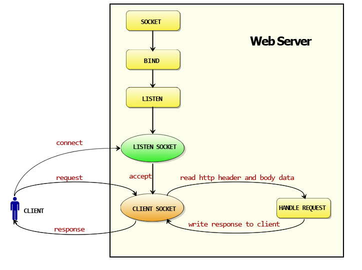
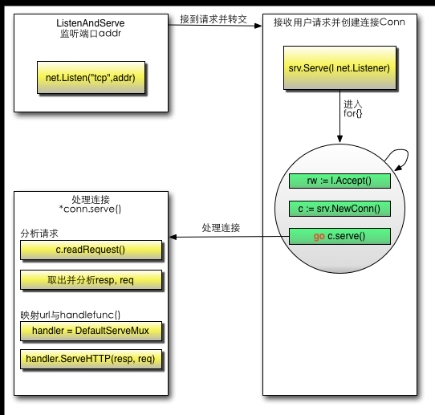

# Go Web

## Web工作方式

浏览器本身是一个客户端，当你输入URL的时候，首先浏览器会去请求DNS服务器，通过DNS获取相应的域名对应的HTTP Request包后，服务器接收到请求包之后才开始处理请求包，服务器调用自身服务，返回HTTP Response包；客户端收到来自服务器的响应后开始渲染这个Response包里的主体，等收到全部的内容随后断开与该服务器之间的TCP连接。

### Web服务器的工作原理可以简单地归纳为

- 客户机通过TCP/IP协议建立到服务器的TCP连接
- 客户端向服务器发送HTTP协议请求包，请求服务器里的资源文档
- 服务器向客户机发送HTTP协议应答包，如果请求的资源包含有动态语言的内容，那么服务器会调用动态语言的解释引擎负责处理“动态内容”，并将处理得到的数据返回给客户端。
- 客户机与服务器断开。由客户端解释HTML文档，在客户端屏幕上渲染图形结果。

**DNS是域名系统，是一种组织成域层次结构的计算机和网络服务命名系统，它用于TCP/IP网络，从事将主机名或域名转换为实际IP地址的工作。**

HTTP是一个无状态的面向连接的协议，无状态不代表HTTP不能保持TCP连接，更不能代表HTTP使用的是UDP协议（面向无连接）

***

## 3.3 Go如何使得Web工作

## 3.4 Go的http包详解

Go的HTTP有两个核心功能：Conn、ServeMux

